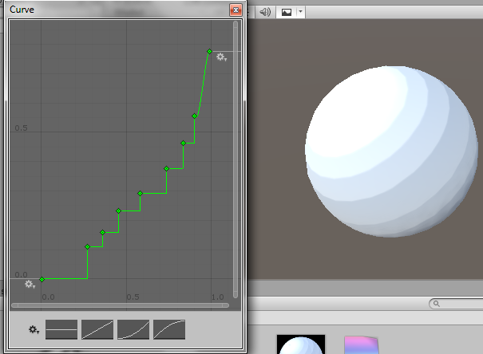

# Procedural Toon Shader

A shader that allows you to create your toon presets procedurally.

Requires:
	
	Gradient texture (Generated by given script, hence procedural)

# Algorithm

The magic script takes an animation curve with XY values from 0-1 and generates
a gradient of a given width W by sampling the curve at point

currentPixel = (1/W) * currentPixelIndex;

and writing to a texture of size (W, 1).

The texture is then fed into the shader that samples the texture for its final lighting value (0-1). 

